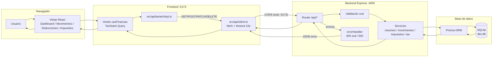
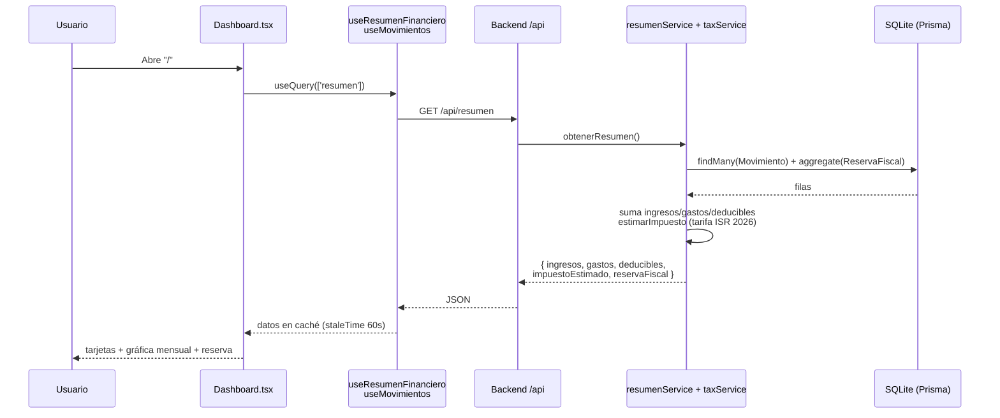
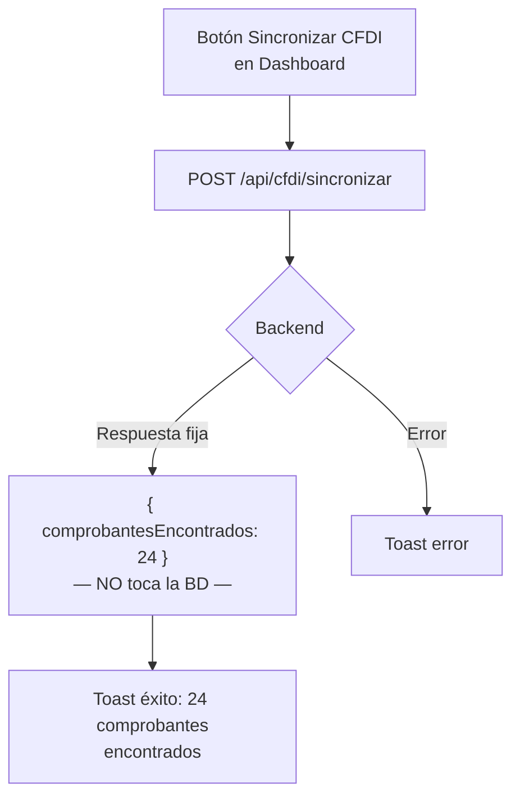
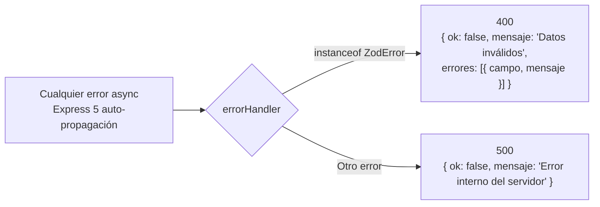

# TaxTech — Diagramas de flujo

Diagramas en sintaxis [Mermaid](https://mermaid.js.org) (se renderizan en VSCode, GitHub, Obsidian, etc.).

## 1. Arquitectura general



## 2. Flujo de datos del Dashboard



## 3. CRUD de movimientos

```mermaid
flowchart TD
    A[Usuario en /movimientos] --> B{Pulsó botón?}

    B -->|"+ Nuevo"| C[Abre Modal + FormularioMovimiento]
    B -->|"Editar"| D[Modal precargado]
    B -->|"Eliminar"| E[window.confirm]

    C --> F[Valida campos zod]
    D --> F
    F --> G{¿Nuevo o edición?}
    G -->|Nuevo| H[POST /api/movimientos]
    G -->|Edición| I[PATCH /api/movimientos/:id]
    E --> J[DELETE /api/movimientos/:id]

    H --> K[ErrorHandler]
    I --> K
    J --> K
    K -->|400 o 500| L[Aviso de error]
    K -->|201 / 200 / 204| M[Aviso de éxito]

    M --> N[Invalidar caché<br/>['movimientos'] y ['resumen']]
    N --> O[Todas las vistas se refrescan]
    L --> O
```

## 4. Deducciones (switch deducible)

```mermaid
flowchart LR
    U[Usuario alterna switch] --> P[PATCH /movimientos/:id<br/>body: { deducible: !deducible }]
    P --> R{Respuesta}
    R -->|200| I[Invalidar caché]
    R -->|error| E[Aviso error]
    I --> X[Dashboard e Impuestos<br/>recalculan ISR]
```

## 5. Impuestos y reserva fiscal

```mermaid
flowchart TD
    U[Usuario en /impuestos] --> P[Elige % 10-30 o monto]
    P --> M[input 0-100]
    M --> A[monto = ingresos x % / 100]
    A --> R[POST /api/impuestos/reservar<br/>body: { cantidad }]
    R --> R2{Respuesta}
    R2 -->|201| I[Invalidar caché<br/>resumen]
    R2 -->|400| E[Aviso error]
    I --> N[Barra de progreso de reserva<br/>se actualiza]

    subgraph Desglose[Desglose calculado en cliente con utils/tax.ts]
        D1[Ingresos] --> D2[Tope deducciones 10%]
        D2 --> D3[Base gravable]
        D3 --> D4[Tramo LISR 2026]
        D4 --> D5[ISR estimado]
    end
```

## 6. Sincronización CFDI (simulación)



## 7. Manejo de errores

